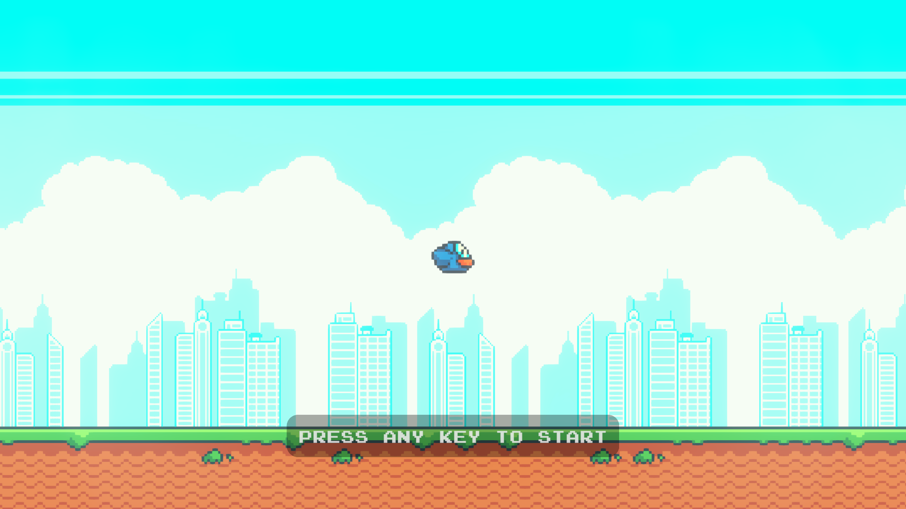
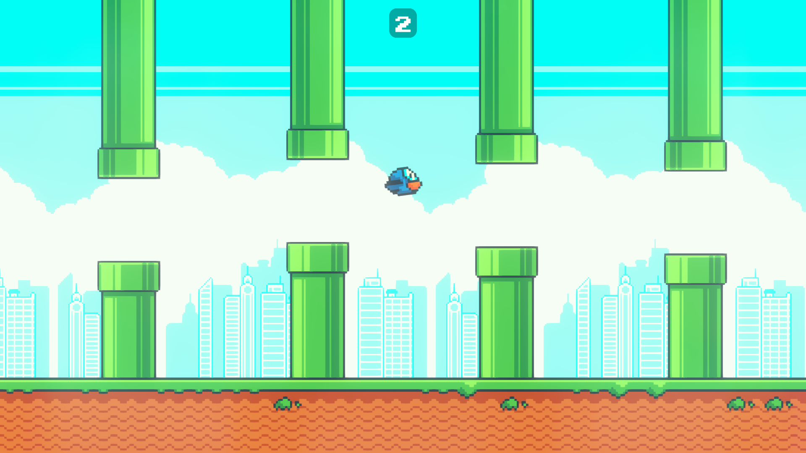

# 🐦 Flappy Bird (Unity Clone)

A small **Flappy Bird clone**, built in about **10 hours** using **Unity 6.0**.  
Play the game here: [▶️ Itch.io](https://rainixx.itch.io/flappy-bird)

---

## 📸 Screenshots

  
  

---

## 🧑‍💻 Code & Development
- **All code inside `/Assets/Scripts` is 100% written by me.**  
- Built from scratch in Unity with C#.  
- Total dev time: ~10 hours.  
- Focused on clean structure, simple mechanics, and rapid prototyping.

---

## 🎮 Controls
- **Space / Left Mouse** – Jump  
- Avoid the pipes and survive as long as possible!

---

## 📦 Asset Credits
- Graphics & sounds: [megacrash – Flappy Bird Assets](https://megacrash.itch.io/flappy-bird-assets)

---

## ⚙️ Tech
- Unity 6.0  
- C# (MonoBehaviour scripts)  
- 2D physics, sprite animation, simple state machine  
- Build target: WebGL (Itch.io), Windows

---

## 🚀 Play Now
👉 [Play on Itch.io](https://rainixx.itch.io/flappy-bird)
